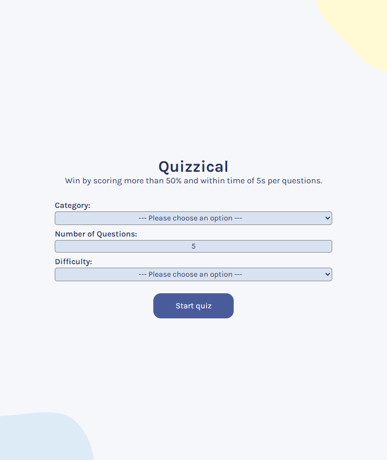
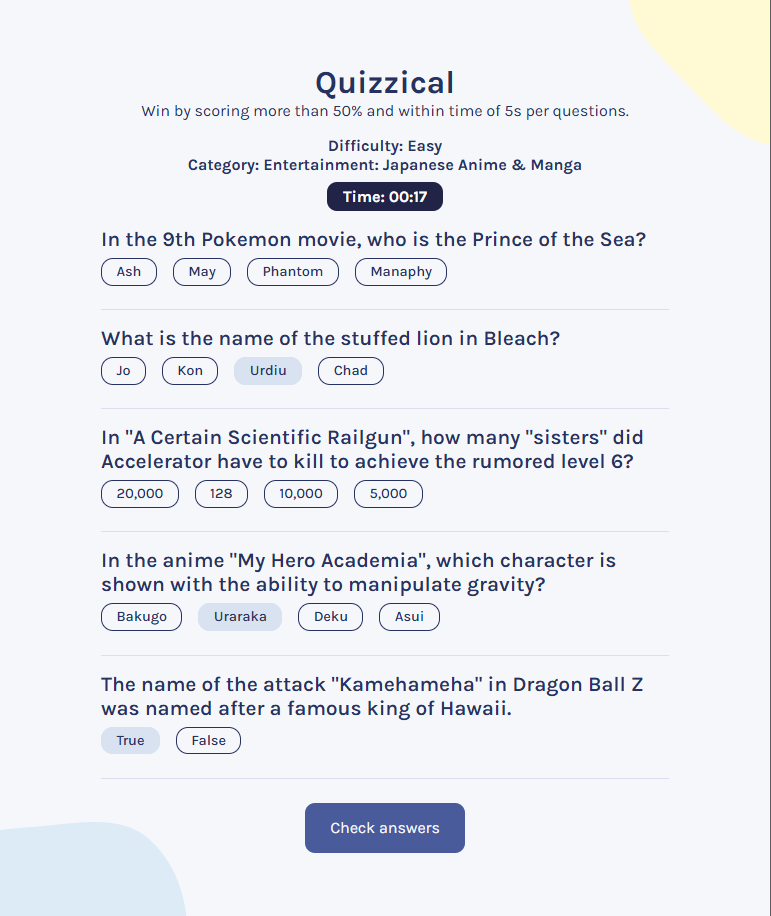
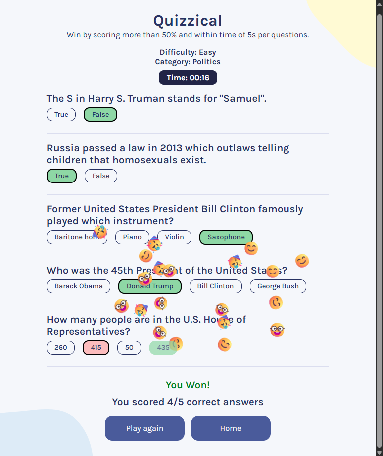
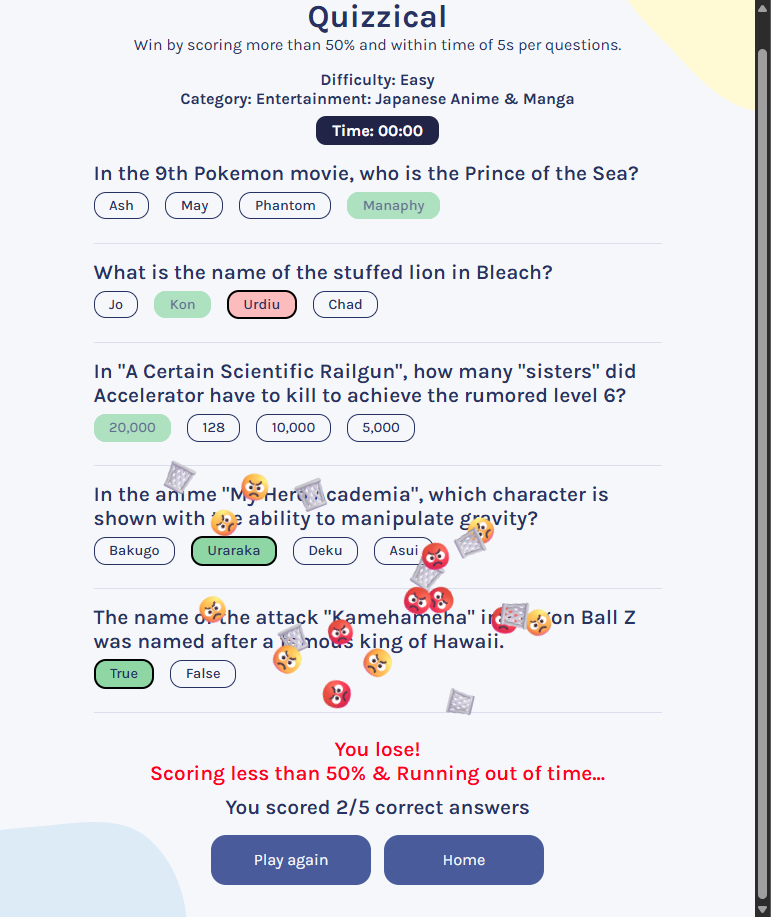

# Quizzical
A quiz app powered by [Open Trivia Database](https://opentdb.com/) and built on React Library.

## Implementation
Visit the implementation here: https://quizzical-tmi2.onrender.com/

    
    

    
    

## Features
* Players are provided options to customize the game configuration in terms of category, number of questions (5-10) and difficulty (easy, medium and hard).
* Players won the game by scoring more than 50% within a total time of 5s per questions.
* If the players fail to submit answers within time, it will be considered as a loss and answers will be automatically revealed.
* During the process of fetching data from API, interactions with buttons are not allowed.

## Key Takeaways
Refer to this repository: https://github.com/wengti/react-note